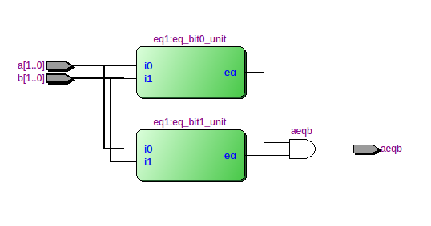
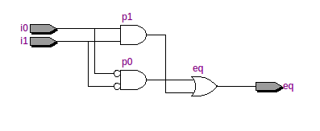
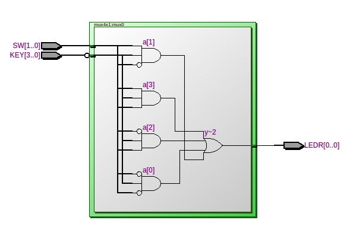

# [Fareed R](./index.md)


# FPGA - Zero to Calculator

## Introduction

I have been curious about digital electronics for a long time and have attempted to learn the subject making significant progress when I watched [Building an 8-bit breadboard computer!](https://www.youtube.com/playlist?list=PLowKtXNTBypGqImE405J2565dvjafglHU) by [Ben Eater](https://www.youtube.com/@BenEater) on YouTube quite a long time ago. I also partially read [Digital Computer Electronics - Malvino, Paul](https://www.amazon.com.au/Digital-Computer-Electronics-Albert-Malvino/d). However, I never got myself to gather the components to actually build a 'breadboard' computer myself. Being a person who learns by doing and not just watching, this left me without a true grasp of fundamental concepts of digital electronics.

I knew something called FPGAs and CPLDs existed since working on an advanced DVB settop box around 2005 where it was innovatively used to communicate between two processors. However, I was never truly curious about it thinking that it was part of some dark art that needed brilliant brains to comprehend. Until, a few months ago (November 2025), by chance, I stumbled upon the most beautiful looking educational board on FB Marketplace called "[Altera DE1](https://www.terasic.com.tw/cgi-bin/page/archive.pl?No=83)" which the owner parted with for A$35.

<br>
*The Altera DE1*

When I switched it on, it ran the factory demo with running lights and cyclic hex numbers on the seven-segment displays. After researching a little, I realized that it was a phased-out board but had immense educational value with the ability to host a RISC soft-core processor called [Nios II](https://en.wikipedia.org/wiki/Nios_II). The amount of 'hardware' that could be crammed into this board opened a plethora of possibilities in my mind. It was a mysterious concoction that sparked immense cuirosity and triggered quite a compulsion to get something useful working on the board.

I downloaded "Quartus II v13.1" which was releaed on 2013 and set about making it work on a modern Linux Mint machine. Surprisingly, with slight [tweaks by zkrx](https://zkre.xyz/posts/quartus/), it now runs like a charm crunching away synthesis, analysis, fitting etc. required to compile VHDL code into something that can be loaded onto the FPGA and turn the board into whatever custom machine one can imageine. Of course, you can get an upgraded FPGA which would also most probably have a hard-processing system which you can communicate with the FPGA part of the machine. However, the DE1 is sufficient for my current needs so I don't see the point of a ugrading yet.

As part of my personal tradition, historically whenever I learnt a new interactive language or framework like VisualBasic (1992) or C(1993) or HTML/JavaScript (2001) or QT (2005) or Arduino(2016), or any other, I would always make a calculator as my first project. So it made absolute sense to make one as the first major project when learning the closest to pure hardware with a board that has facinating I/Os.

Starting with knowing absolutely nothing about FPGAs, in about a months time, working a few hours every week, I was able to grasp the very basics and make a small 3 decimal digit 2-s compliment integer calculator that demonstrates some of the fundamental concepts I encountered. It may not look like much but it got me ready for the next step which will be an 8-digit fixed-point calculator which I hope to soon publish. In the meanwhile, if you are an absolute beginner like me, I invite you to follow along the journey of 10 short lessons with the hope that it may spark your curiosity too.

I have used LLMs extremely sparingly in this project as I believe that AI is a surefire way to loose all joy in learning. I have published the source code of this journey on GitHub in a public repository called [fareed1983/fpga-zero-to-calculator](https://github.com/fareed1983/fpga-zero-to-calculator).


## What is an FPGA

A [field-programmable-gate-array (FPGA)](https://en.wikipedia.org/wiki/Field-programmable_gate_array) is an integrated circuit containing a grid array of programmable logic cells that can be configured in different ways and interconnected to mimic digital logic devices. Individually, each cell can be configured to act as simple logic gates and perform complex combinational and sequential functions as configured units. There are specialized languages used to configure FPGAs out of which, this tutorial uses Verilog. These custom hardware devices could be as simple as a push-button turning on an LED to as complex as and advanced system-on-chip.

## Experiment 0: [2-Bit Comparitor](https://github.com/fareed1983/fpga-zero-to-calculator/tree/main/00-comparator)

The first 'program' I tried was an example provided in [Embedded SoPC Design with Nios II Processor and Verilog Examples (Pong P. Chu, 2012)](https://www.amazon.com.au/dp/1118011031) discussed in Chapter 2 with a short tutorial in section 3.5. It describes a a gate-level combinational circuit using the hardware description language (HDL) called Verilog. The code listing is available at - https://github.com/fareed1983/fpga-zero-to-calculator/tree/main/00-comparator. The first two switches of the DE1 (SW0 & SW1) are compared with the next two switches (SW2 & SW3) and if they are equal an LED lights up. It was simple but powerful to get a hang on how to use Quartus II and Verilog HDL. Detailed instructions are provided in the book to get this program up and running. On a high-level these instructions include:
* 

The file [list_ch03_01_eq1.v](https://github.com/fareed1983/fpga-zero-to-calculator/blob/main/00-comparator/list_ch03_01_eq1.v) implements a gate-level 1-bit comparator. When compiled, Quartus II compiles the project performing elaboration, systhesis, placement and routing into the FPGA ultimately mimicing how such a circuit would be created using logic-gates. The following 'netlist' is synthesized from the code.



The diagram is produced by the Quartus II Netlist Viewer and shows the 2-bit comparator composed of 2 units of 1-bit comparitors. The inputs of the comparators are SW0 to SW3. These keys are mapped using the eq2.pin.csv file. The output of the comparators is then ANDed to give the result which is connected to LED0. Zoomming into one of the 1-bit comparators, we see the following gate-level diagram.



The diagram shows a very basic 1-bit comparator and is quite self-explanatory.One point to note is that the 'code' in a HDL here is combinatorial logic and produces a circuit all-at-once unlike instructions provided to a microprocessor. We are building custom special-purpose machines rather than programming a general-purpose computer.


## Project 1: [2-Bit Half Adder](https://github.com/fareed1983/fpga-zero-to-calculator/tree/main/01-half-adder)

I moved on to Malvino's *Digital Computer Electronics* with the aim of making the described computer using gate-level logic to get a deep grasp of the topic. However, that's not what I found out later and thus switched strategy later.

I started this monumental task with rereading parts of the brilliant book and made the simplest [adder](https://en.wikipedia.org/wiki/Adder_(electronics)) at the gate-level in Verilog HDL.

The file listing of [ha.v](https://github.com/fareed1983/fpga-zero-to-calculator/blob/main/01-half-adder/ha.v) is as follows:
```
module ha
	(
		input wire a, b,
		output wire c, s
	);
	
	assign c = a & b;
	assign s = a ^ b;
	
endmodule
```
The above synthesizes to the half-adder circuit with the following truth-table:

|a|b|sum|carry|
|-|-|-|-|
|0|0|0|0|
|0|1|1|0|
|1|1|0|1|

The other file [tst.v](https://github.com/fareed1983/fpga-zero-to-calculator/blob/main/01-half-adder/tst.v) is a simple rig connecting switches (SW) and red-LEDs (LEDR) on the board. The pin-assignments to use by default is provided in the root folder.

## Project 2 - [2-Bit Full Adder](https://github.com/fareed1983/fpga-zero-to-calculator/tree/main/02-full-adder)

Next, I implemented a full-adder with the following truth table:
|a|b|carry_in|sum|carry_out|
|-|-|-|-|-|
|0|0|0|0|0|
|0|1|0|1|0|
|1|1|0|0|1|
|0|0|1|1|0|
|1|0|1|0|1|
|1|1|1|1|1|

Full adders can be chained and the carry output of the previous can be provided as carry input thus creating an adder of multiple bits.

## Project 3 - [4-Bit Binary Adder](https://github.com/fareed1983/fpga-zero-to-calculator/tree/main/03-binary-adder)

Here, I used the previously created full-adder to chain them to add two 4-bit numbers inputted from SW0-SW3 & SW5-SW8. The output is provided in 5 bits on the green LEDs from LEDG[0]-LEDG[4]. Following is the code listing of the top-level module in the file [ba.v](https://github.com/fareed1983/fpga-zero-to-calculator/blob/main/03-binary-adder/ba.v):
```
module ba
	(
		input wire[0:8] SW,
		output wire[0:4] LEDG
	);
	
	wire [0:3] carry;
	
	ha ha0 (.a(SW[0]), .b(SW[5]), .sum(LEDG[0]), .carry(carry[0]));
	fa fa1 (.a(SW[1]), .b(SW[6]), .c(carry[0]), .sum(LEDG[1]), .carry(carry[1]));
	fa fa2 (.a(SW[2]), .b(SW[7]), .c(carry[1]), .sum(LEDG[2]), .carry(carry[2]));
	fa fa3 (.a(SW[3]), .b(SW[8]), .c(carry[2]), .sum(LEDG[3]), .carry(LEDG[4]));
	
endmodule
```

The above synthezises into a circuit resembling the diagram below from Wikipedia except that the first block is a half-adder as there is no requirement for a carry-in.


The following video from Ben Eater provides an excellent explanation of how this works:

<iframe width="420" height="315"
src="https://www.youtube.com/watch?v=wvJc9CZcvBc">
</iframe>


## Project 4 - [2s Compliment Adder & Subtractor](https://github.com/fareed1983/fpga-zero-to-calculator/tree/main/04-2s-compliment-adder-subtractor)

Next I moved on to revising how 2-s compliment works and making a 2-s compliment adder and subtractor circuit. This project gave me a good grasp of 2-s compliment denomination which I had learnt many times in C-programming books but never fully comprehended before. It is easy to understand from the HDL code listing of [as2c.v](https://github.com/fareed1983/fpga-zero-to-calculator/blob/main/04-2s-compliment-adder-subtractor/as2c.v) below and compare it to Malvino's Fig. 6-7.

```
module as2c
	(
		input wire[3:0] a, b,
		input wire sub,
		output wire [3:0] sum,
		output wire overflow
	);
	
	wire [3:0] c;
	wire[3:0] bn;
	assign bn = b ^ {4{sub}};
	
	fa fa0 (.a(a[0]), .b(bn[0]), .c(sub), 	.sum(sum[0]), .carry(c[0]));
	fa fa1 (.a(a[1]), .b(bn[1]), .c(c[0]),	.sum(sum[1]), .carry(c[1]));
	fa fa2 (.a(a[2]), .b(bn[2]), .c(c[1]),	.sumf(sum[2]), .carry(c[2]));
	fa fa3 (.a(a[3]), .b(bn[3]), .c(c[2]),	.sum(sum[3]), .carry(c[3]));
	
	assign overflow = c[2] ^ c[3];
	
endmodule

```

The first full-adder module is initialized with the sub(tract) input and the input b is negated when subtraction is high. Here we see a non-gate-level construct in the form of the XOR with 0x1111 if subtraction is required. This is synthesized into the circut shown and is what negates b.This causes the 2-s compliment of b to be fed into the circuit. The rest is normal addition.

## Project 5 - [Latch is Impossible](https://github.com/fareed1983/fpga-zero-to-calculator/tree/main/05-rs-latch-impossible)

After somewhat nailing the ALU, I moved on to trying to make a latch but no matter what I did, I could not get it to work at the 'gate-level' on the FPGA.  When Quartus detects a combinational feedback loop as in the case of a latch, it complains. It is important to understand that FPGAs are composed of cells that contain configurable look-up tables (LUTs). While these can be configured to contain feedback, they are discouraged and there are specific ways to implement them to work correctly but result in overly complex designs.

The following listing correctly defines a R-S latch which does not work. You will find it in the commit history of The file [rs.v](https://github.com/fareed1983/fpga-zero-to-calculator/blob/main/05-rs-latch-impossible/rs.v}.

```
module rs
	(
		input wire s, r,
		output wire q, qbar
	);
	
	assign q = ~(r | qbar);
	assign qbar = ~(s | q);
	
endmodule

```

However the modified listing below does work:

```
module rs
	(
		input wire s, r,
		output wire qbar,
		output reg q
	);
	
	assign qbar = ~q;
	
	 // when any input (s or r) changes, evaluate this block
	always @(*) begin
		if (s & ~r)
			q = 1'b1;
		else if (!s & r)
			q = 1'b0;
		// else hold latch state
	end
	
endmodule
```

Here, the output q is now defined as a register instead of a wire which simply means that it can be assigned inside an 'always' block. It does not map to a register in hardware.

Honestly, I am yet to figure out why the first one is not 'synthesized' correctly but I will update here when I have more insights.

## Project 6 - [4x1 Multiplexer](https://github.com/fareed1983/fpga-zero-to-calculator/tree/main/06-4x1-multiplexer)

The file [mux4x1.v](https://github.com/fareed1983/fpga-zero-to-calculator/blob/main/06-4x1-multiplexer/mux4x1.v) descibes a very simple multiplexer circuit where the inputs are provided with the pushbuttons SW0-SW3 and the channel selector are the switches SW0-SW1 in binary. The output is displayed on the the first red LED (LEDR0).

Wikipedia provides the following diagram:


Quartus synthesises an equavalent shown below:



Although a multiplexer is not used in the calculator, the thought of making a calculator occured to me at this point in the journey. I decided to make a calculator first and not a full-fledged general-purpose computer because for the computer, instructions were redily available.

## Project 7 - [Decimal Display](https://github.com/fareed1983/fpga-zero-to-calculator/tree/main/07-decimal-display)

Now we inch closer to making the calculator by displaying decimal numbers from 0-255 based on the input provided on SW0-SW3. I started with displaying the output of 4 bits to one of the seven-segment-displays (HEX0) available on the DE1. The file [bin2ssd.v](https://github.com/fareed1983/fpga-zero-to-calculator/blob/main/07-decimal-display/bin2ssd.v) is listed as follows:
```
module bin2ssd #(
		parameter INVERT = 1'b0
	)(
		input wire[3:0] b,
		output wire[6:0] s
	);
	
	wire[6:0] seg;
	assign seg =(b == 4'h0) ? 7'b0111111 :
					(b == 4'h1) ? 7'b0000110 :
					(b == 4'h2) ? 7'b1011011 :
					(b == 4'h3) ? 7'b1001111 :
					(b == 4'h4) ? 7'b1100110 :
					(b == 4'h5) ? 7'b1101101 :
					(b == 4'h6) ? 7'b1111101 :
					(b == 4'h7) ? 7'b0000111 :
					(b == 4'h8) ? 7'b1111111 :
					(b == 4'h9) ? 7'b1101111 :
					(b == 4'hA) ? 7'b1110111 :
					(b == 4'hB) ? 7'b1111100 :
					(b == 4'hC) ? 7'b0111001 :
					(b == 4'hD) ? 7'b1011110 :
					(b == 4'hE) ? 7'b1111001 :
								  7'b1110001 ;
	
	assign s = INVERT ? seg ^ 7'b1111111 : seg;
	
	
endmodule
```

As you see, it is simple code that turns on certain segments given certain hex values provided in 4 bits. The parameter INVERT is used to initialize the module specifying that the segements are on when the HEX[6:0] are set low. Thus we negate the values before assigning them to the output in our case. Although the calculator is not to feature a hex display, hex digits were added for completion.

Double dabble - I always knew BCD (binary-coded decimal) representation of binary numbers existed but I never knew what it is used for. While faced with the challenge of displaying decimal numbers, I understood the significance of this method. I came across the most amazing high-quality explanation of the double-dabble technique made by [Sebastian Lague](https://www.youtube.com/@SebastianLague). I highly recommend watching it entirely. Coming from a programming background, it was facinating to learn how complex combinational logic circuits can be created for purposes that we assume can only be done with sequential logic. I use parts of the methods demonstrated in the video even further in the calculator project.


<iframe width="420" height="315"
src="https://www.youtube.com/watch?v=hEDQpqhY2MA&t=1836s">
</iframe>


## Project 8 - 10-Bit Decimal Display

## Project 9 - Blink LED

## Project 10 - Calculator


# [< Back to Fareed R](./index.md)
